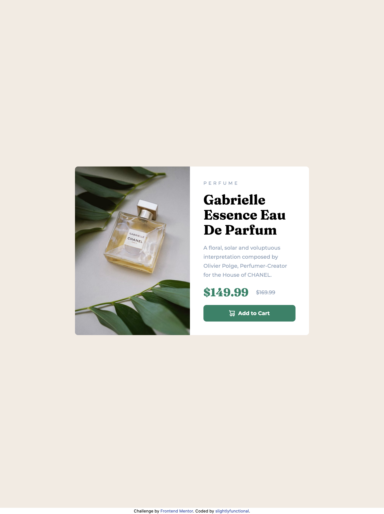

# Frontend Mentor - Product preview card component solution

This is a solution to the [Product preview card component challenge on Frontend Mentor](https://www.frontendmentor.io/challenges/product-preview-card-component-GO7UmttRfa). Frontend Mentor challenges help you improve your coding skills by building realistic projects. 

## Table of contents

- [Overview](#overview)
  - [The challenge](#the-challenge)
  - [Screenshot](#screenshot)
  - [Links](#links)
- [My process](#my-process)
  - [Built with](#built-with)
  - [Continued development](#continued-development)
  - [Useful resources](#useful-resources)
- [Author](#author)

## Overview

### The challenge

Users should be able to:

- View the optimal layout depending on their device's screen size
- See hover and focus states for interactive elements

### Screenshot

### Links

- Live Site URL: [https://slightlyfunctional.gitlab.io/product-preview-card/](https://slightlyfunctional.gitlab.io/product-preview-card/)

## My process

### Built with

- Semantic HTML5 markup
- Flexbox
- CSS Grid
- Mobile-first workflow
- [TailwindCSS](https://tailwindcss.com/)
- [Parcel](https://parceljs.org/)

### Continued development

I want to get more comfortable writing CSS using BEM methodology without relying on a lib or framework like Tailwind. I am slowly working on another project (junior level) simulteanously that does it using SASS. I currently struggle with getting the sizing correct to emulate the design spec accurately but this is something I've come to the conclusion will only be achieved over time through repeated practice. 

### Useful resources

- [Native Responsive Images](https://dev.opera.com/articles/native-responsive-images/) - This is an interesting article from one of the developers on the Opera team explaining the usage behavior of the `picture` and `img` elements 

## Author

- Website - [slightlyfunctional.com](https://slightlyfunctional.com)
- Frontend Mentor - [@slightlyfunctional](https://www.frontendmentor.io/profile/slightlyfunctional)
